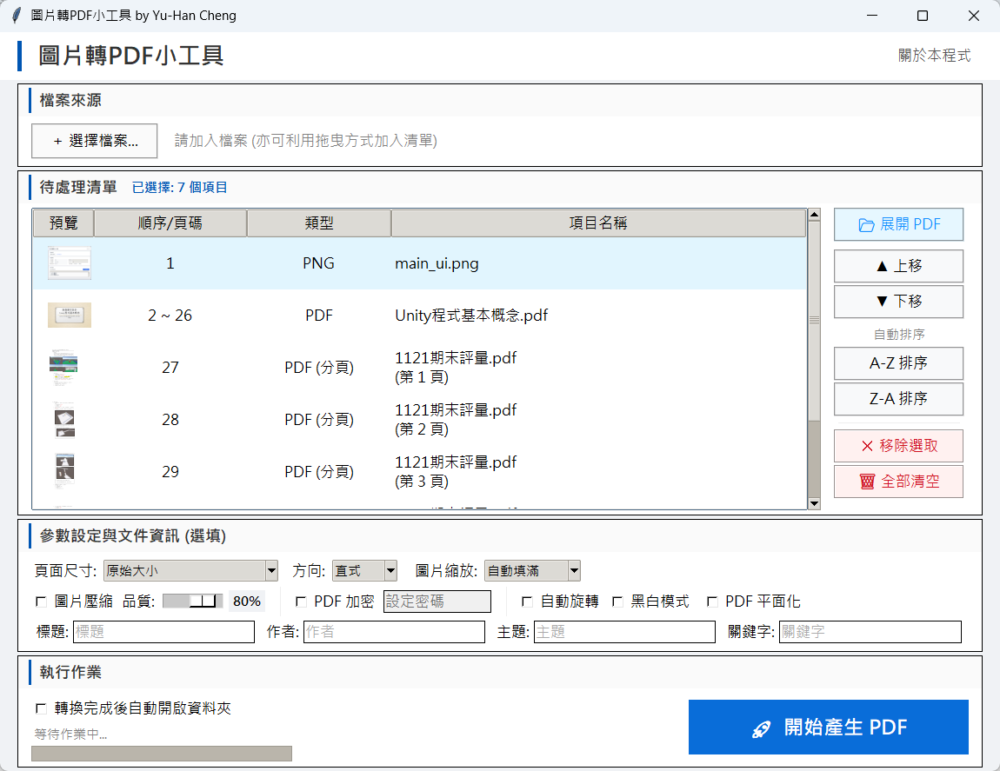

# 圖片轉 PDF 小工具




*(▲ 程式執行主畫面)*


一個基於 Python 開發的簡單 GUI 工具，支援透過「拖放」方式將多張圖片及 PDF 快速轉換為單個 PDF 檔案。本專案整合了 `tkinterdnd2` 以提供直觀的拖放介面，並使用 `PyMuPDF (fitz)` 進行 PDF 處理。


## 🌟 主要功能


* 不需透過繁瑣的檔案瀏覽器尋找路徑，支援直接將多個圖片檔案，甚至是包含圖片的「整個資料夾」拖入程式視窗，系統會自動過濾並辨識可支援的圖片格式。

* 專為大量圖片處理設計，能夠一次性將清單中選取的所有圖片或 PDF 依序合併為單個 PDF 檔案。

* **多格式支援**：支援常見的圖片格式（JPG, PNG, BMP 等）及PDF檔案。

* **輕量化**：簡潔的 GUI 介面，操作簡單。


## 🛠️ 安裝要求


在執行此專案之前，請確保您的系統已安裝 Python 3.14 或更高版本，並安裝以下依賴套件：


```bash

pip install pymupdf tkinterdnd2

```


## 一般使用者下載

如果您不想安裝 Python 環境，只想要簡單地直接使用軟體，我已經將打包成單一執行檔了。 請前往本專案的 **[Releases 頁面](https://github.com/kaoshou/image-pdf-converter/releases)** 下載後直接執行EXE檔即可，無需安裝任何軟體。

